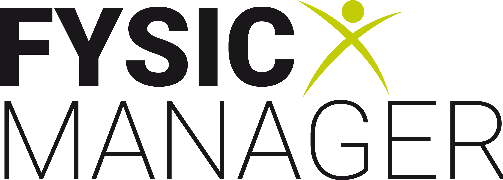

# FysicManager API

<!-- Add your logo here -->


> A RESTful API for physiotherapy practice management and scheduling system

## 📋 Overview

FysicManagerAPI is a robust backend service designed specifically for physiotherapy practices to manage appointments, patients, therapists, and practice operations. Built with .NET 9 and Entity Framework Core, it provides a complete solution for modern physiotherapy clinic management.

### 🌐 Frontend Repository
The client application can be found at: [Daanylo/FysicManager-Client](https://github.com/Daanylo/FysicManager-Client)

## ✨ Features

### 👥 Patient Management
- Complete patient records with personal information
- Medical history tracking
- BSN (Dutch social security number) support
- Contact information management

### 🏥 Practice Management
- Multiple practice support
- Practice-specific configurations
- Location and contact details
- Color-coded practice identification

### 👨‍⚕️ Therapist Management
- Therapist profiles and qualifications
- Specialization tracking
- Multi-practice assignments
- Contact information

### 📅 Appointment Scheduling
- Flexible appointment booking system
- Multiple appointment types support
- Duration-based scheduling
- Notes and description fields
- **Timezone-aware scheduling** (UTC+2 summer time support)

### ⏰ Workshift Management
- Therapist work schedule management
- Practice-specific workshifts
- Time-based filtering
- **Timezone-aware time tracking**

### 🔍 Specialization System
- Medical specialization categories
- Therapist-specialization mapping
- Targeted patient care

### 📊 Access Logging
- Comprehensive API access tracking
- Performance monitoring
- User session management
- Request/response analytics

## 🛠️ Technology Stack

- **.NET 9** - Latest framework with performance improvements
- **ASP.NET Core** - Web API framework
- **Entity Framework Core** - ORM with SQL Server support
- **SQL Server LocalDB** - Development database
- **System.Text.Json** - Modern JSON serialization
- **Swagger/OpenAPI** - API documentation

## 🚀 Getting Started

### Prerequisites

- .NET 9 SDK
- SQL Server LocalDB (included with Visual Studio)
- Visual Studio 2022 or VS Code

### Installation

1. **Clone the repository**
   ```bash
   git clone https://github.com/YourUsername/FysicManagerAPI2.git
   cd FysicManagerAPI2
   ```

2. **Restore packages**
   ```bash
   dotnet restore
   ```

3. **Apply database migrations**
   ```bash
   cd FysicManagerAPI
   dotnet ef database update
   ```

4. **Run the application**
   ```bash
   dotnet run
   ```

The API will be available at:
- HTTP: `http://localhost:5000`
- HTTPS: `https://localhost:5001`
- Swagger UI: `https://localhost:5001/swagger`

## 🗃️ Database Schema

### Core Entities

- **Patients** - Patient information and demographics
- **Practices** - Physiotherapy practice locations
- **Therapists** - Healthcare providers
- **Appointments** - Scheduled patient sessions
- **Workshifts** - Therapist working hours
- **Specializations** - Medical specialization areas
- **AppointmentTypes** - Different types of treatments
- **AccessLogs** - API usage tracking

### Relationships

- Therapists ↔ Practices (Many-to-Many)
- Therapists ↔ Specializations (Many-to-Many)
- Appointments → Patient, Therapist, Practice, AppointmentType
- Workshifts → Therapist, Practice

## 🌐 API Endpoints

### Appointments
- `GET /api/appointment/all` - Get all appointments
- `GET /api/appointment` - Get appointments with filters
- `GET /api/appointment/{id}` - Get specific appointment
- `POST /api/appointment` - Create new appointment
- `PUT /api/appointment/{id}` - Update appointment
- `DELETE /api/appointment/{id}` - Delete appointment

### Patients
- `GET /api/patient/all` - Get all patients
- `GET /api/patient/{id}` - Get specific patient
- `POST /api/patient` - Create new patient
- `PUT /api/patient/{id}` - Update patient
- `DELETE /api/patient/{id}` - Delete patient

### Therapists
- `GET /api/therapist/all` - Get all therapists
- `GET /api/therapist/{id}` - Get specific therapist
- `POST /api/therapist` - Create new therapist
- `PUT /api/therapist/{id}` - Update therapist
- `DELETE /api/therapist/{id}` - Delete therapist

### Practices
- `GET /api/practice/all` - Get all practices
- `GET /api/practice/{id}` - Get specific practice
- `POST /api/practice` - Create new practice
- `PUT /api/practice/{id}` - Update practice
- `DELETE /api/practice/{id}` - Delete practice

### Workshifts
- `GET /api/workshift/all` - Get all workshifts
- `GET /api/workshift` - Get workshifts with filters
- `GET /api/workshift/{id}` - Get specific workshift
- `POST /api/workshift` - Create new workshift
- `PUT /api/workshift/{id}` - Update workshift
- `DELETE /api/workshift/{id}` - Delete workshift

### Access Logs
- `GET /api/accesslog/all` - Get all access logs (with pagination)

## ⚙️ Configuration

### Database Connection

Update `appsettings.json` for your environment:

```json
{
  "ConnectionStrings": {
    "DefaultConnection": "Server=(localdb)\\mssqllocaldb;Database=FysicManagerDb;Trusted_Connection=true;MultipleActiveResultSets=true"
  }
}
```

### CORS Configuration

The API is configured to allow all origins for development. Update CORS settings in `Program.cs` for production deployment.

## 🕐 Timezone Handling

The API includes sophisticated timezone handling:

- **Storage**: All DateTime values are stored as UTC in the database
- **Input**: Accepts local time (UTC+2 for Dutch summer time)
- **Output**: Returns local time for client consumption
- **Automatic Conversion**: Seamless conversion between local and UTC times

## 📁 Project Structure

```
FysicManagerAPI/
├── Controllers/          # API Controllers
├── Data/                # Database Context
├── Middleware/          # Custom Middleware
├── Migrations/          # EF Core Migrations
├── Models/              # Entity Models
│   └── DTOs/           # Data Transfer Objects
└── Properties/          # Launch Settings

FysicManagerAPI.Tests/   # Unit Tests
```

## 🧪 Testing

Run the test suite:

```bash
dotnet test
```

The project includes unit tests for:
- Patient Controller operations
- Practice Controller operations
- Database seeding functionality

## 🚀 Deployment

### Development
```bash
dotnet run --environment Development
```

### Production
```bash
dotnet publish -c Release
dotnet FysicManagerAPI.dll --environment Production
```

## 🔒 Security Features

- **CORS Protection** - Configurable cross-origin requests
- **Request Logging** - Comprehensive access tracking
- **Input Validation** - Model validation and sanitization
- **Error Handling** - Structured error responses

## 📈 Performance Features

- **Efficient Queries** - Optimized Entity Framework queries
- **Async Operations** - Non-blocking database operations
- **Response Caching** - Configurable caching strategies
- **Connection Pooling** - Database connection optimization

## 🤝 Contributing

1. Fork the repository
2. Create a feature branch (`git checkout -b feature/AmazingFeature`)
3. Commit your changes (`git commit -m 'Add some AmazingFeature'`)
4. Push to the branch (`git push origin feature/AmazingFeature`)
5. Open a Pull Request

## 📝 License

This project is licensed under the MIT License - see the [LICENSE](LICENSE) file for details.

## 📞 Support

For support and questions:
- Create an issue in this repository
- Check the [client repository](https://github.com/Daanylo/FysicManager-Client) for frontend-related issues

## 🙏 Acknowledgments

- Built with .NET 9 and Entity Framework Core
- Designed for Dutch physiotherapy practice requirements
- Timezone handling optimized for European operations

<div align="center">
    
</div>
